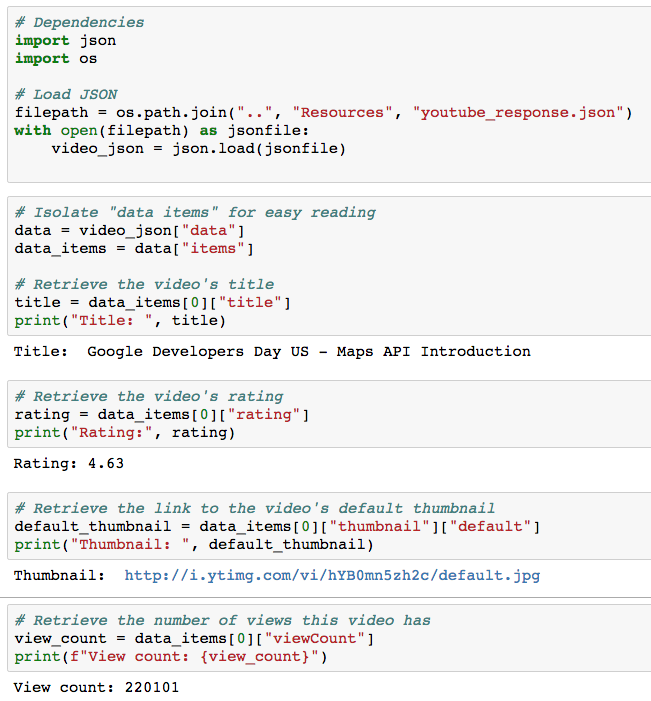
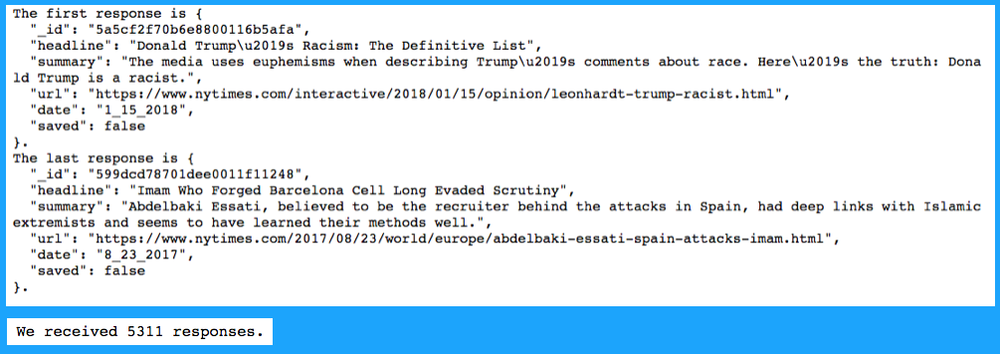
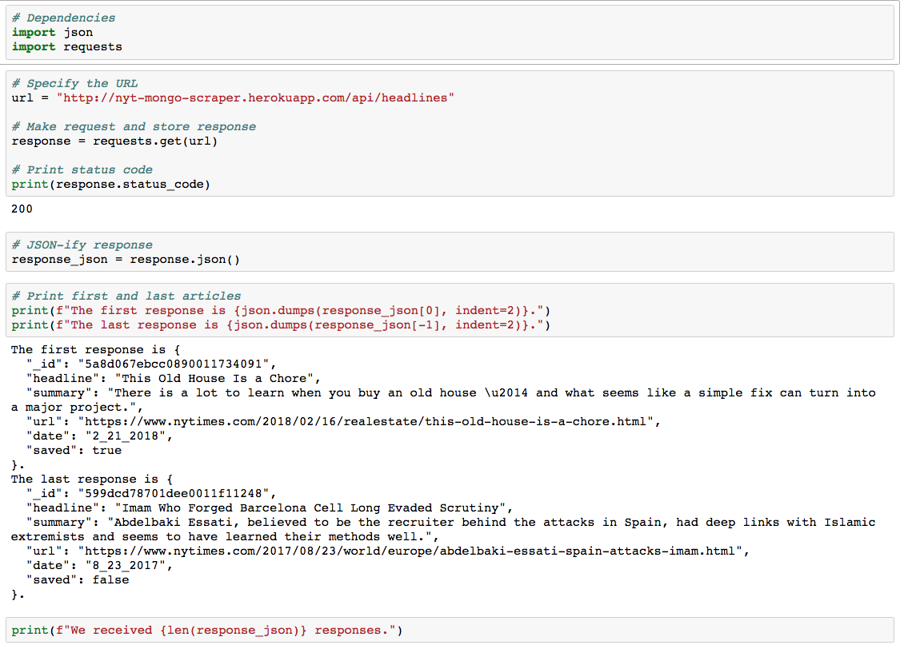
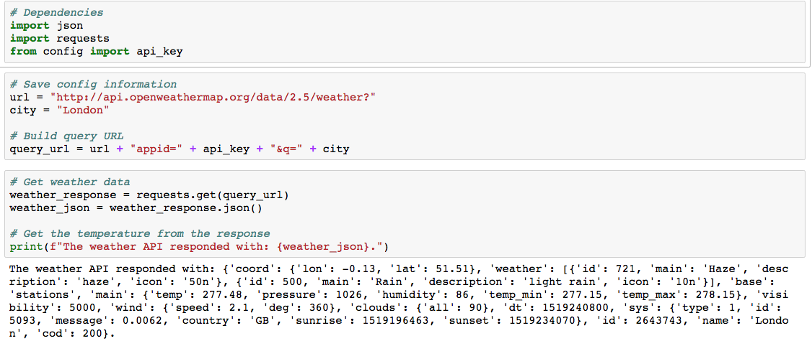
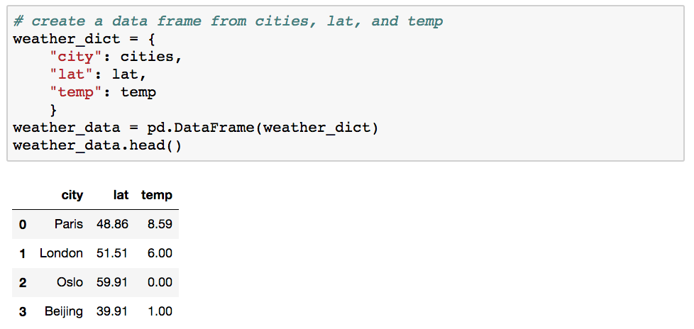
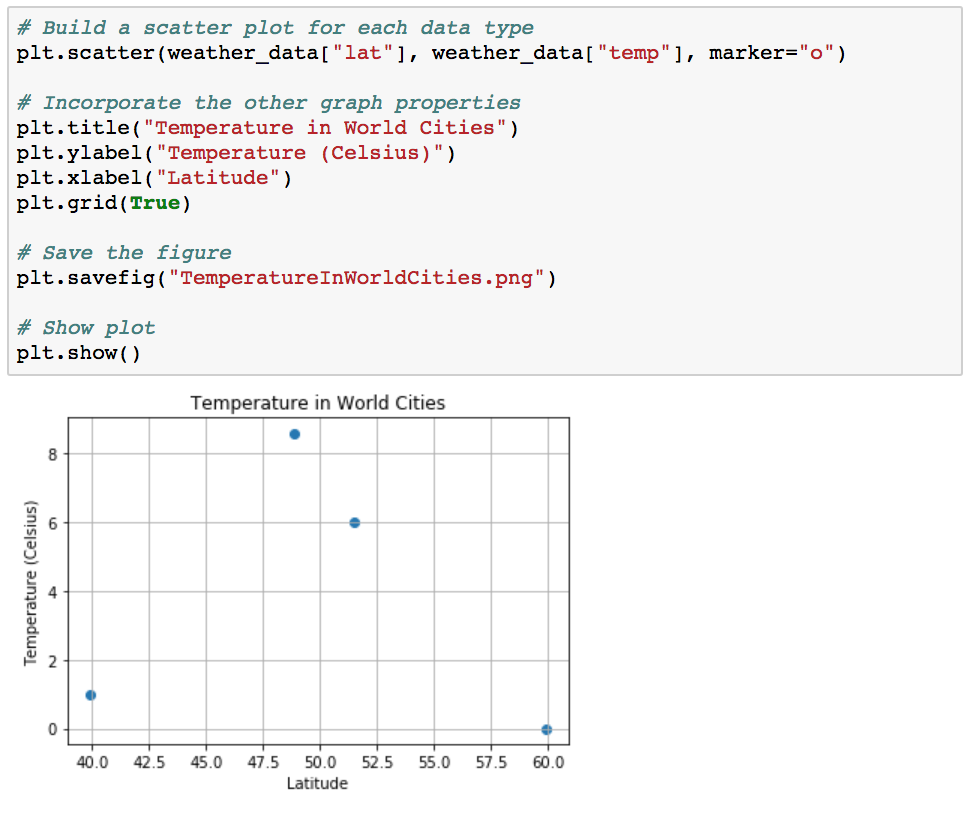
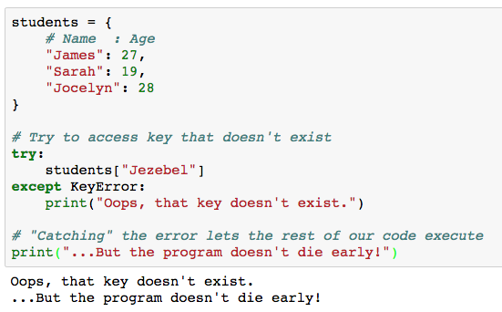
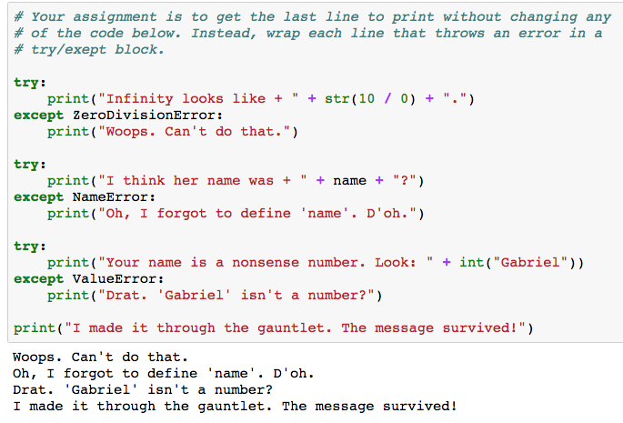
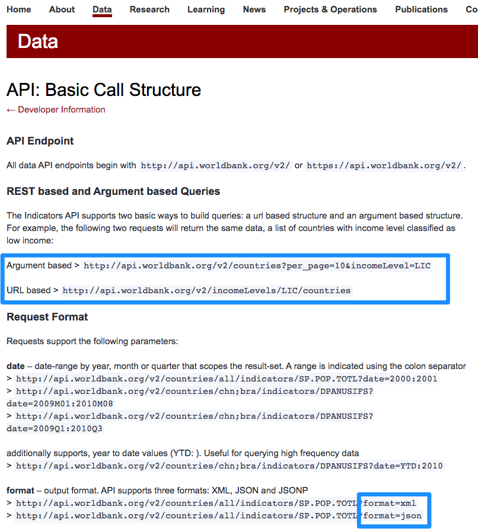
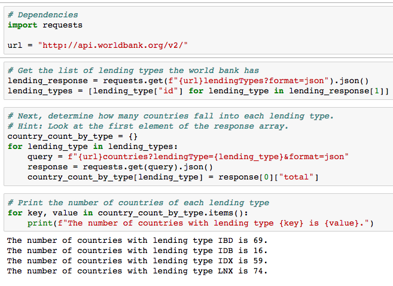

# 6.2 Working with Weather & City APIs

## Overview

Today's class introduces the class to a number of new APIs whilst also discussing API wrappers, exception handling, and using Pandas with API responses.

## Class Objectives

* Students will create applications from scratch using nothing but their knowledge of Python and an API documentation
* Students will load JSON from API responses into a Pandas DataFrame
* Students will be able to use `try` and `except` blocks to handle errors

## Instructor Prep

<details>
    <summary><strong>Instructor Priorities</strong></summary>

* Students should be able to familiarize themselves with API documentation effectively.

* Students should be able to use data from the OpenWeatherMap and World Bank APIs.

* Students should be able to load JSON from API responses into a Pandas DataFrame.

* Students should be able to use `try`/`except` blocks to handle exceptions.

</details>

<details>
    <summary><strong>Instructor Notes</strong></summary>

* The website used in the second student activity (Students Do: Requests Review) is an interactive one and the data can be edited by anyone. Prior to class, be sure to visit [http://nyt-mongo-scraper.herokuapp.com/](http://nyt-mongo-scraper.herokuapp.com/), click "Scrape New Articles!", then click "Save Article" for each one that appears below.

* Please reference our [Student FAQ](../../../05-Instructor-Resources/README.md#unit-06-python-APIs) for answers to questions frequently asked by students of this program. If you have any recommendations for additional questions, feel free to log an issue or a pull request with your desired additions.

* Have your TAs refer to the [6.2 Time Tracker](TimeTracker.xlsx) to remain on track.

</details>

<details>
    <summary><strong>Sample Class Video</strong></summary>

* To view an example class lecture visit (Note: video may not reflect latest lesson plan): [Class Video](https://codingbootcamp.hosted.panopto.com/Panopto/Pages/Viewer.aspx?id=e8aabdaf-e74e-4f9c-b851-aa4f0187f90c)

</details>

- - -

# Class Activities

## 1. JSON Traversal

| Activity Time:       0:00 |  Elapsed Time:      0:00  |
|---------------------------|---------------------------|

<details>
    <summary><strong>✏️ 1.1 Students Do: JSON Traversal (10 mins)</strong></summary>

* **Files:**

  * [youtube_response.json](Activities/01-Stu_JSONTraversalReview/Resources/youtube_response.json)

  * [Stu_JSON_Traversal.ipynb](Activities/01-Stu_JSONTraversalReview/Unsolved/Stu_JSON_Traversal.ipynb)

* **Instructions:** [README.md](Activities/01-Stu_JSONTraversalReview/README.md)

* Open the [slideshow](https://docs.google.com/presentation/d/1oIKNTLRt06zkHrXrFyNGr9ICnl3-DrJhrgkEmINPTa4) and use slides 1-5 to introduce the class to the first activity.

* Welcome the students to class and explain that today we will be expanding our API querying abilities.

  * Today's class will focus on making our get requests more robust. We will also explore different methods of storing and analyzing our API responses.

* Explain that today's class will begin with a short review of what was covered during the previous lesson. In this activity, students will be traversing a JSON file using their knowledge of Python.

* Open [01-Stu_JSONTraversalReview/youtube_response.json](Activities/01-Stu_JSONTraversalReview/Resources/youtube_response.json) with a text editor to show the class what JSON file they will be working with.

  

</details>

<details>
    <summary><strong>⭐ 1.2 Review: JSON Traversal (5 mins)</strong></summary>

* Open up [Stu_JSON_Traversal.ipynb](Activities/01-Stu_JSONTraversalReview/Solved/Stu_JSON_Traversal.ipynb) in Jupyter Notebook and run through the code with the class line-by-line, making certain to hit upon the following points.

  * Emphasize that the best way to solve problems like this one is to inspect the JSON manually and pull it apart once its structure is clear.

  * Point out that this activity introduces no new techniques other than importing external JSON files. This challenge merely requires students to carefully read the JSON as they write their scripts.

    

</details>

<sub>[Having issues with this activity? Report a bug!](https://form.jotform.com/93104673884161?activityTitle=1.%20JSON%20Traversal&lessonTitle=Weather%20and%20City%20APIs&lessonNumber=6.2)</sub>

- - -
  
## 2. Requests Review

| Activity Time:       0:00 |  Elapsed Time:      0:00  |
|---------------------------|---------------------------|

<details>
    <summary><strong>✏️ 2.1 Students Do: Requests Review (15 mins)</strong></summary>

* **File:** [Stu_RequestReview.ipynb](Activities/02-Stu_RequestReview/Unsolved/Stu_RequestReview.ipynb)

* **Instructions:** [README.md](Activities/02-Stu_RequestReview/README.md)

* Explain that students have one more review before they dive into the bulk of the day's lesson. For this activity, students will be making an API call to a NYT scraper and printing out data from the response.

* Open [Stu_RequestReview.ipynb](Activities/02-Stu_RequestReview/Solved/Stu_RequestReview.ipynb) in Jupyter Notebook and run the code or simply show students the below image to show students what they will be attempting to create.

  

* Open the [slideshow](https://docs.google.com/presentation/d/1oIKNTLRt06zkHrXrFyNGr9ICnl3-DrJhrgkEmINPTa4) and use slide 6-8 to display the instructions.

</details>

<details>
    <summary><strong>⭐ 2.2 Review: Requests Review (5 mins)</strong></summary>

* Open up [Stu_RequestReview.ipynb](Activities/02-Stu_RequestReview/Solved/Stu_RequestReview.ipynb) with Jupyter Notebook and run through the code with the class line-by-line, asking different students how they implemented each task in the instructions.

  * Make sure to point out how the first and last responses are being printed to the screen. The index of `[0]` will always contain the first value of a list and the index of `[-1]` will always contain the last.

  * In order to collect the length of the list, simply use the `len()` function and pass the list in as the sole parameter.

    

</details>

<sub>[Having issues with this activity? Report a bug!](https://form.jotform.com/93104673884161?activityTitle=2.%20Requests%20Review&lessonTitle=Weather%20and%20City%20APIs&lessonNumber=6.2)</sub>

- - -
  
## 3. Weather in Burundi

| Activity Time:       0:00 |  Elapsed Time:      0:00  |
|---------------------------|---------------------------|

<details>
    <summary><strong>📣 3.1 Instructor Do: OpenWeatherMap API (10 mins)</strong></summary>

* Open the [slideshow](https://docs.google.com/presentation/d/1oIKNTLRt06zkHrXrFyNGr9ICnl3-DrJhrgkEmINPTa4)  and use slides 9-12 to accompany the beginning of this demonstration.

* Explain that the next API students will work with is the [OpenWeatherMap API](https://openweathermap.org/api), which provides various sorts of meteorological data for developers to use.

* Explain that, like the New York Times API, the OpenWeatherMap API requires users to [register](https://home.openweathermap.org/users/sign_up) for an API key.

  * Briefly walk students through the [sign-up](https://home.openweathermap.org/users/sign_up) steps and make sure everyone has their API key in-hand before moving on to the demonstration.

  

* Remind students that it is good practice to use `config.py` file to shield their api_keys from others' view.

* Point out that the workflow for OpenWeatherAPI functions the same as the other APIs we have previously covered.

* Open [Ins_OpenWeatherRequest.ipynb](Activities/03-Ins_OpenWeatherRequest/Solved/Ins_OpenWeatherRequest.ipynb) with Jupyter Notebook to show students what the application does.

  

* Ask a student to explain what the question mark in the URL indicates before explaining how the question mark represents the beginning of the query string.

* Ask a student to explain what they think the query URLs is requesting before discussion how the `q` parameter allows the application to search for weather by city name in English.

* Ask a student to explain the logic of the rest of the file and then explain how the rest of the file simply sends a GET request to the query url, converts the response to JSON, and prints the result.

  

</details>

<details>
    <summary><strong>✏️ 3.2 Students Do: Weather in Burundi (15 mins)</strong></summary>

* **File:** [Stu_Burundi.ipynb](Activities/04-Stu_Burundi/Unsolved/Stu_Burundi.ipynb)

* **Instructions:** [README.md](Activities/04-Stu_Burundi/README.md)

* The class will now work with the OpenWeather API and create an application which provides the user with the current temperature in the largest city of Burundi.

* Before students complete the next activity, show them the following image or [Stu_Burundi.ipynb](Activities/04-Stu_Burundi/Solved/Stu_Burundi.ipynb) in Jupyter Notebook so that students understand the expected output.

  

* Open the [slideshow](https://docs.google.com/presentation/d/1oIKNTLRt06zkHrXrFyNGr9ICnl3-DrJhrgkEmINPTa4) and use slide 13-15 to display the instructions.

</details>

<details>
    <summary><strong>⭐ 3.3 Review: Burundi  (5 mins)</strong></summary>

* Open up [Stu_Burundi.ipynb](Activities/04-Stu_Burundi/Solved/Stu_Burundi.ipynb) in Jupyter Notebook and run through the code with the class line-by-line asking different students how they implemented each task in the instructions.

* Try to focus in upon the following points:

  * When building the query URL, remind students that this is the most important piece of making an API call as it determines what information will be returned by the request.

  * The `units` query parameter: Remind students that they simply need to dig through documentation to find "options" like this. Encourage them to spend a lot of time reading the documentation of an API before writing code as this will save them time.

    

  * Ask students to offer explanations of how they solved the bonus.

</details>

<sub>[Having issues with this activity? Report a bug!](https://form.jotform.com/93104673884161?activityTitle=3.%20Weather%20in%20Burundi&lessonTitle=Weather%20and%20City%20APIs&lessonNumber=6.2)</sub>

- - -
  
## 4. TV Ratings

| Activity Time:       0:00 |  Elapsed Time:      0:00  |
|---------------------------|---------------------------|

<details>
    <summary><strong>📣 4.1 Instructor Do: OpenWeatherMap DataFrame (10 mins)</strong></summary>

* Open the [slideshow](https://docs.google.com/presentation/d/1oIKNTLRt06zkHrXrFyNGr9ICnl3-DrJhrgkEmINPTa4)  and use slides 16-19 to accompany the beginning of this demonstration.

* Point out to  students that they are not limited to analyzing API responses manually.

  * By working with API responses in JSON objects, we can easily import these objects into pandas.

  * Pandas allows us  to manipulate the large amounts of data returned by APIs in bulk.

* Remind students that if we use lists to store all of our metrics of interest, we can convert a list of lists into a pandas DataFrame

* Point out once the data is stored in a pandas DataFrame, we can analyze, summarize or plot using our favorite Python libraries.

* Open [Ins_OpenWeatherDataFrame.ipynb](Activities/05-Ins_OpenWeatherDataFrame/Solved/Ins_OpenWeatherDataFrame.ipynb) within Jupyter Notebook in order to show students how pandas can be used to organize/manipulate the data retrieved from an API.

  * Point out that the beginning of this script is no different from before where the configuration information is set and stored.

* Explain that it might be interesting to look at how the temperature in a country changes based upon its latitude.

* Refer to the [OpenWeatherMap API documentation](https://openweathermap.org/current#data) or [sample response](http://samples.openweathermap.org/data/2.5/find?q=London&appid=b6907d289e10d714a6e88b30761fae22) and point out that our responses have both these pieces of data stored within them.

* Explain that a for loop is used to send a request to the Weather API for each city stored within the `cities` list, and then the desired data is appended to respective lists.

  

* Since the application has now collected data on each of the cities desired, a dictionary can be created in order to use a Pandas DataFrame to house this data.

    

* Point out that the rest is simple matplotlib. Simply call `scatter()` on the DataFrame to create a scatter plot of the temperatures versus the latitudes.

    

</details>

<details>
    <summary><strong>✏️ 4.2 Students Do: TV Ratings (10 mins)</strong></summary>

* **File:** [Stu_TVRatings.ipynb](Activities/06-Stu_TVRatings/Unsolved/Stu_TVRatings.ipynb)

* **Instructions:** [README.md](Activities/06-Stu_TVRatings/README.md)

* The class will now take some time to create an application that reads in a list of TV shows, makes multiple requests from an API to retrieve rating information, creates a pandas dataframe, and visually displays the data.

* Open the [slideshow](https://docs.google.com/presentation/d/1oIKNTLRt06zkHrXrFyNGr9ICnl3-DrJhrgkEmINPTa4) and use slide 20-21 to display the instructions and sample output.

* Before students complete [Stu_TVRatings.ipynb](Activities/06-Stu_TVRatings/Unsolved/Stu_TVRatings.ipynb) explain to them that they will be using the [TVmaze API Show Search Endpoint](https://www.tvmaze.com/api#show-search) to iterate through a list of TV shows.

  

</details>

<details>
    <summary><strong>⭐ 4.3 Review: TV ratings (5 mins)</strong></summary>

* Open up [Stu_TVRatings.ipynb](Activities/06-Stu_TVRatings/Solved/Stu_TVRatings.ipynb)with Jupyter Notebook and run through the code with the class line-by-line, making certain to discuss the following points.

  * Ask students how data was isolated from each response and loaded it into a Pandas DataFrame.

  * For students who made their own list of TV shows, ask if any requests returned no results thereby causing an error.  This discussion might be a nice lead into the next activity on exception handling.

  * Review how to create a bar chart using matplotlib.

    

</details>

<sub>[Having issues with this activity? Report a bug!](https://form.jotform.com/93104673884161?activityTitle=4.%20TV%20Ratings&lessonTitle=Weather%20and%20City%20APIs&lessonNumber=6.2)</sub>

- - -
  
## 5. Weather Statistics

| Activity Time:       0:00 |  Elapsed Time:      0:00  |
|---------------------------|---------------------------|

<details>
    <summary><strong>✏️ 5.1 Students Do: Weather Statistics (15 mins)</strong></summary>

* **Files:** [weather_stats.ipynb](Activities/07-Stu_Weather_Stats/Unsolved/weather_stats.ipynb)

* **Instructions:** [README.md](Activities/07-Stu_Weather_Stats/README.md)

* The class will now generate a regression model on a dataset from the Open Weather API to predict the temperature of a city.

* Open the [slideshow](https://docs.google.com/presentation/d/1oIKNTLRt06zkHrXrFyNGr9ICnl3-DrJhrgkEmINPTa4) and use slide 23-25 to display the instructions.

</details>

<details>
    <summary><strong>⭐ 5.2 Review: Weather Statistics (5 mins)</strong></summary>

* **Files:**

  * [weather_stats.ipynb](Activities/07-Stu_Weather_Stats/Solved/weather_stats.ipynb)

* Open the solution and go over the code. Explain that the code used to place the API call and to create the DataFrame is identical to the code from a previous activity.

  ```python
  cities = ["Paris", "London", "Oslo", "Beijing", "Mumbai", "Manila", "New York", "Seattle", "Dallas", "Taiwan"]

  # set up lists to hold response info
  lat = []
  temp = []

  # Loop through the list of cities and perform a request for data on each
  for city in cities:
      response = requests.get(query_url + city).json()
      lat.append(response['coord']['lat'])
      temp.append(response['main']['temp'])

  print(f"The latitude information received is: {lat}")
  print(f"The temperature information received is: {temp}")
  ```

  ```python
  # create a data frame from cities, lat, and temp
  weather_dict = {
      "city": cities,
      "lat": lat,
      "temp": temp
  }
  weather_data = pd.DataFrame(weather_dict)
  weather_data
  ```

* Next, move on to how to create a scatter plot from the data and explain:

  * `weather_data['lat']` stores the x values while `weather_data['tmp']` stores the y values.

  * A scatter plot is created based on those values.

* After creating the scatter plot explain to students they will need perform linear regression and plot the line. Explain:

  * The scipy stats library is used to perform linear regression and get `slope`, `intercept`, `rvalue`, `pvalue`, and `stderr`

  ```python
  # Perform a linear regression on latitude vs. temperature
  (slope, intercept, rvalue, pvalue, stderr) = stats.linregress(x_values, y_values)

  # Get regression values
  regress_values = x_values * slope + intercept
  print(regress_values)
  ```

  * A line equation using the resulting values is created.

  * A new scatter plot is created, this time with a regression line.

  ```python
  # Create Plot
  plt.scatter(x_values,y_values)
  plt.plot(x_values,regress_values,"r-")

  # Label plot and annotate the line equation
  plt.xlabel('Latitude')
  plt.ylabel('Temperature')
  plt.annotate(line_eq,(20,15),fontsize=15,color="red")

  # Print r square value
  print(f"The r-squared is: {rvalue}")

  # Show plot
  plt.show()
  ```

* Now that we have an equation for linear regression, temperature for Florence can be predicted. Explain:

  * The latitude of Florence can be plugged into the regression line to predict the city's temperature.

  ```python
  # Calculate the temperature for Florence at 34.8
  florence_lat = 34.8
  florence_predicted_temp = round(vc_slope * florence_lat + vc_int,2)

  print(f"The Predicted temperature for Florence will be {florence_predicted_temp}.")
  ```

  * Finally, a call is made to the API to find out the actual current temperature.

</details>

<sub>[Having issues with this activity? Report a bug!](https://form.jotform.com/93104673884161?activityTitle=5.%20Weather%20Statistics&lessonTitle=Weather%20and%20City%20APIs&lessonNumber=6.2)</sub>

- - -

## Break

| Activity Time:       0:15 |  Elapsed Time:      0:00  |
|---------------------------|---------------------------|

- - -

## 6. Making Exceptions

| Activity Time:       0:00 |  Elapsed Time:      0:00  |
|---------------------------|---------------------------|

<details>
    <summary><strong>📣 6.1 Instructor Do: Exception Handling (5 mins)</strong></summary>

* Open the [slideshow](https://docs.google.com/presentation/d/1oIKNTLRt06zkHrXrFyNGr9ICnl3-DrJhrgkEmINPTa4)  and use slides 27-31 to accompany the beginning of this demonstration.

* Point out that the OpenWeatherMap API is robust enough that it responded with every piece of information. There were no missing values.

  * Not every API is as solid as the OpenWeatherMap API, however, and sometimes responses will not contain all of the requested data.

* Ask a student to explain what would happen if an application tried to look up a key within a dictionary that doesn't exist.

  * If a simple key lookup is performed - such as `data["temp"]` - and the `"temp"` key doesn't exist, Python will throw an exception and terminate the program.

* Explain that this behavior makes sense in a basic application or script because the program may have incorrect/missing inputs.

  * However when it comes to databases and API requests, missing values are very common. In these cases, our applications and scripts that use API calls are at risk of terminating prematurely.

* Point out it does not make sense for an application to terminate itself just because a dictionary key doesn't exist. It would be much better to simply deal with the error than crash the app.

  * Dealing with these kinds of errors is called exception handling and thankfully Python has built-in tools to resolve these errors, a process called exception handling.

* Open [Ins_Exception.ipynb](Activities/08-Ins_ExceptionHandling/Solved/Ins_Exception.ipynb) within Jupyter Notebook to show how an exception error can be created.

  * Point out that the `students` dictionary does not have a key for `"Jezebel"`. When the application tries to print `students["Jezebel"]`, Python will complain that the key doesn't exist.

  * Run the code within the terminal to demonstrate the error.

    

* Open [Ins_ExceptionHandling.ipynb](Activities/08-Ins_ExceptionHandling/Solved/Ins_ExceptionHandling.ipynb) within Jupyter Notebook to show the class how to handle exception errors.

  * Before discussing the code in detail, simply point out the `try`/`except` keywords to the class. Briefly explain that these keywords let the application recover from errors like the one that killed the program before.

  * Run the file to demonstrate that the final print statement executes, even though the `students["Jezebel"]` line throws an exception.

    

  * Explain that `try` and `except` statements, like `for` and `if` statements, create new indented blocks.

  * Python will try to run code in the `try` block, but if an exception arises, Python will then run the code inside the `except` block.

    

* Take a moment to emphasize how powerful this is. try/except allows programmers to anticipate and recover from errors.

* Although optional, it is generally best practice to specify the precise errors to handle.

  * In cases where the programmer wants to handle a particular error in a particular fashion, specifying the exception type is best practice.

  * Especially in cases where a programmer wants to intercept any error — like for logging purposes — it is fine to catch a general exception.

* Students will know what exceptions to handle because the name of the exception that killed the program will be printed to the command line.

</details>

<details>
    <summary><strong>✏️ 6.2 Students Do: Making Exceptions (5 mins)</strong></summary>

* **File:** [Stu_MakingExceptions.ipynb](Activities/09-Stu_MakingExceptions/Unsolved/Stu_MakingExceptions.ipynb)

* **Instructions:** [README.md](Activities/09-Stu_MakingExceptions/README.md)

* Students will create an application that, through `try` and `except`, resolves a number of errors.

* Open the [slideshow](https://docs.google.com/presentation/d/1oIKNTLRt06zkHrXrFyNGr9ICnl3-DrJhrgkEmINPTa4) and use slide 32-34 to display the instructions.

* Explain that students will need to get the final line of the script to print without changing the problem code in the file.

  

</details>

<details>
    <summary><strong>⭐ 6.3 Review: Making Exceptions (5 mins)</strong></summary>

* Open up [Stu_MakingExceptions.ipynb](Activities/09-Stu_MakingExceptions/Solved/Stu_MakingExceptions.ipynb) within Jupyter Notebook and run through the code with the class line-by-line. If there is enough time wrap each "problem line" within the appropriate `try`/`except` block live to demonstrate the workflow for identifying which exceptions to use in the `except` clause.

* Discuss the following points:

  * All the `print` statements are placed under `try` blocks.

  * Specific error types are placed in the `except` block.

  * A `print` statement is added to log when an error occurs.

  * This allows programmers to log certain errors if they occurred.

    

* Explain that it is good practice to wrap dictionary accesses to responses from API calls in `try`/`except` blocks, just in case not all responses have the desired key.

</details>

<sub>[Having issues with this activity? Report a bug!](https://form.jotform.com/93104673884161?activityTitle=6.%20Making%20Exceptions&lessonTitle=Weather%20and%20City%20APIs&lessonNumber=6.2)</sub>

- - -
  
## 7. API Call Exceptions

| Activity Time:       0:00 |  Elapsed Time:      0:00  |
|---------------------------|---------------------------|

<details>
    <summary><strong>✏️ 7.1 Student Do: API Call Exceptions (15 mins)</strong></summary>

* **Files:** [api_exceptions.ipnyb](Activities/10-Stu_API_Exceptions/Unsolved/api_exceptions.ipynb)

* **Instructions:** [README.md](Activities/10-Stu_API_Exceptions/README.md)

* In this activity, students will implement try/except as they make API calls to narrow down a list of fictional characters to include only characters from Star Wars.

* Open the [slideshow](https://docs.google.com/presentation/d/1oIKNTLRt06zkHrXrFyNGr9ICnl3-DrJhrgkEmINPTa4) and use slides 35-37 to display the instructions.

</details>

<details>
    <summary><strong>⭐ 7.2 Review: API Call Exceptions (5 mins)</strong></summary>

* **Files:** [api_exceptions.ipnyb](Activities/10-Stu_API_Exceptions/Solved/api_exceptions.ipynb)

* Open up `api_exceptions.ipnyb` in a notebook. Go through the code explain that the solution should:

  * Loop through each character in the list.

  * Make an API call for each character by appending the character to the URL.

  ```python
  # Create search query, make request and store in json
  query = url + character
  response = requests.get(query)
  response_json = response.json()
  ```

  * Use `try` to attempt to retrieve the height and mass of the character.

  ```python
    try:
        height.append(response_json['results'][0]['height'])
        mass.append(response_json['results'][0]['mass'])
        starwars_characters.append(character)
        print(f"{character} found! Appending stats")
  ```

  * Use `except` to `pass` on characters that would return an error because they do not exist in the Star Wars Universe.

  ```python
  # Handle exceptions for character that not available in the Star Wars API
      except:
          # Append null values
          print("Character not found")
          pass
  ```

  * Store the results in a DataFrame.

</details>

<sub>[Having issues with this activity? Report a bug!](https://form.jotform.com/93104673884161?activityTitle=7.%20API%20Call%20Exceptions&lessonTitle=Weather%20and%20City%20APIs&lessonNumber=6.2)</sub>

- - -
  
## 8. Two Calls

| Activity Time:       0:00 |  Elapsed Time:      0:00  |
|---------------------------|---------------------------|

<details>
    <summary><strong>📣 8.1 Instructor Do: World Bank API (5 mins)</strong></summary>

* Open the [slideshow](https://docs.google.com/presentation/d/1oIKNTLRt06zkHrXrFyNGr9ICnl3-DrJhrgkEmINPTa4)  and use slides 38-40 to accompany the beginning of this demonstration.

* Explain that the next couple of activities will further familiarize students with APIs and reading complex documentation.

* Navigate to the [World Bank API](https://datahelpdesk.worldbank.org/knowledgebase/topics/125589-developer-information) website and explain that the World Bank API provides data on variety of topics including lending types, income levels, and much more.

* Open the [Basic Call Structure](https://datahelpdesk.worldbank.org/knowledgebase/articles/898581-api-basic-call-structure) link and explain the documentation's notes on argument-based vs URL-based queries.

  

  * Argument-based query strings are what the class has been working with thus far today whilst REST based API calls are more like those students utilized during the first class.  Argument-based queries are far more common than url-based queries.

* Open [Ins_WorldBankAPI.ipynb](Activities/11-Ins_WorldBankAPI/Solved/Ins_WorldBankAPI.ipynb) within Jupyter Notebook, running the code once before discussing the application with students line-by-line.

  * Since there is no wrapper installed for this API, the class will have to interface with it directly.

    

* Navigate back to the [top-level documentation page](https://datahelpdesk.worldbank.org/knowledgebase/topics/125589-developer-information) and explain that the other links contain similar documentation for more specific query types.

</details>

<details>
    <summary><strong>👥 8.2 Partners Do: Two Calls (10 mins)</strong></summary>

* **File:** [Stu_TwoCalls.ipynb](Activities/12-Stu_TwoCalls/Unsolved/Stu_TwoCalls.ipynb)

* **Instructions:** [12-Stu_TwoCalls/README.md](Activities/12-Stu_TwoCalls/README.md)

* For this activity, students will be utilizing the World Bank API to make two API calls in sequence. The second API call depends on the response of the first.

* Before slacking students the instructions for [Stu_TwoCalls.ipynb](Activities/12-Stu_TwoCalls/Solved/Stu_TwoCalls.ipynb) show them the following [output](Images/12-TwoCalls_Output.png) so they can see what kid of application they will be creating.

  

* Open the [slideshow](https://docs.google.com/presentation/d/1oIKNTLRt06zkHrXrFyNGr9ICnl3-DrJhrgkEmINPTa4) and use slide 41-43 to display the instructions and sample output.

</details>

<details>
    <summary><strong>⭐ 8.3 Review: Two Calls (5 mins)</strong></summary>

* Open up [12-Stu_Stu_TwoCalls](Activities/12-Stu_TwoCalls/Solved/Stu_TwoCalls.ipynb) within Jupyter Notebook and run through the code with the class line-by-line by having them describe the application.

  * Ask a student to explain how they retrieved the list of lending types.

  * Ask a student to explain how they got a count of how many countries of each lending type the World Bank API has on record.

    

</details>

<sub>[Having issues with this activity? Report a bug!](https://form.jotform.com/93104673884161?activityTitle=8.%20Two%20Calls&lessonTitle=Weather%20and%20City%20APIs&lessonNumber=6.2)</sub>

- - -

### Copyright

Trilogy Education Services © 2019. All Rights Reserved.
